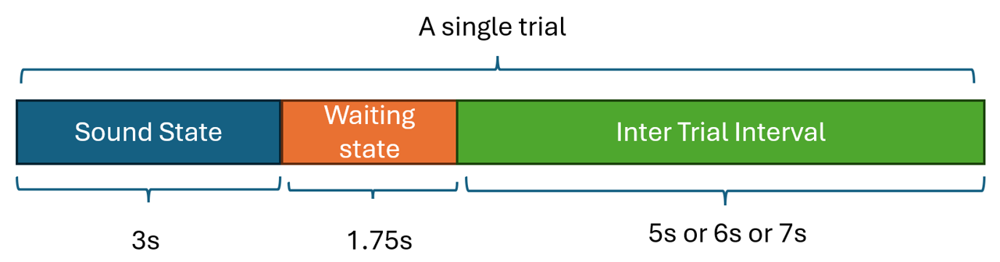
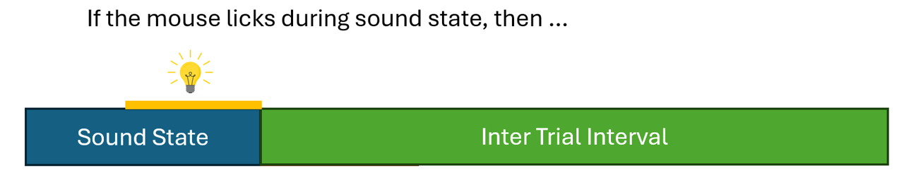
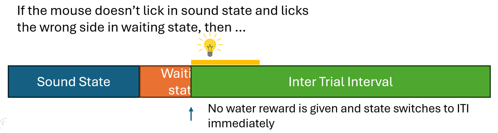
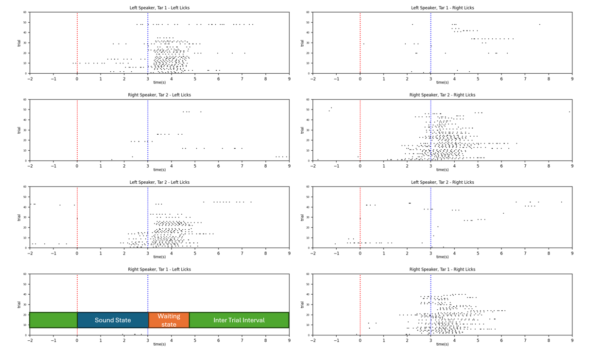
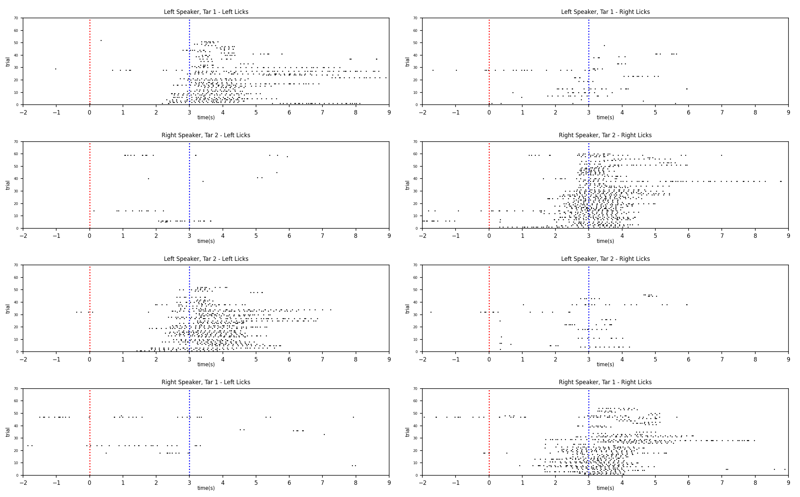
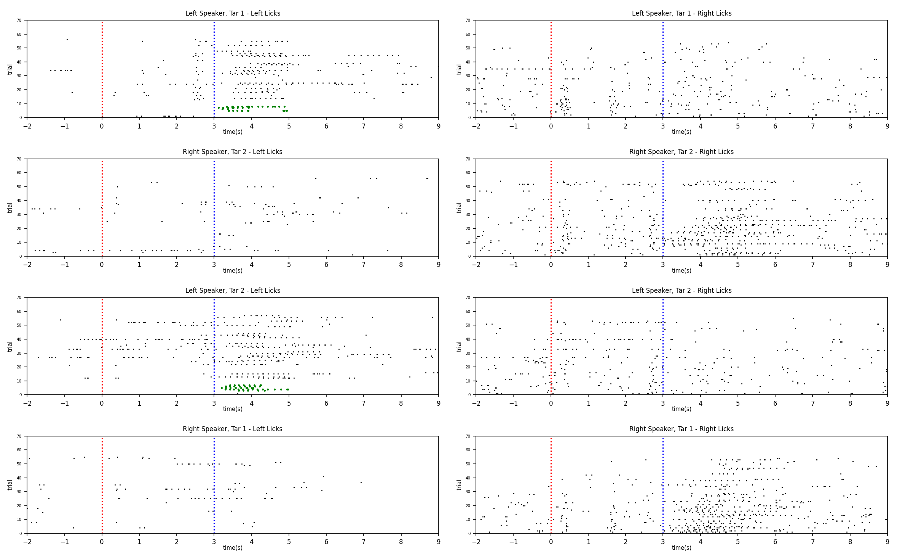

# How Attention and VIP Interneuron Inhibition Shape Auditory Spatial 

## LabVIEW-based behavioral data acquisition in mice
To develop and refine a multi-phase behavioral task using LabVIEW for investigating how attentional mechanisms and VIP interneuron-mediated inhibition influence auditory spatial discrimination in mice. The system progressively introduced task complexity, from basic habituation to reward-based decision-making and error-contingent punishment, enabling precise control over stimulus-response conditions critical for probing neural correlates of spatial attention.

 

## This project contains VI files for behavioral data acquisition in mice.

## Folder Structure
- `src/` – Source code VIs
  &nbsp;&nbsp; &nbsp;&nbsp; VIP_Phase_1.vi
  &nbsp;&nbsp; &nbsp;&nbsp; VIP_Phase_2.vi
  &nbsp;&nbsp; &nbsp;&nbsp; VIP_Phase_3.vi
  &nbsp;&nbsp; &nbsp;&nbsp; VIP_Phase_4.vi
  &nbsp;&nbsp; &nbsp;&nbsp; VIP_Phase_5.vi
  - `array/` – Array-related helper VIs
    &nbsp;&nbsp; &nbsp;&nbsp;&nbsp;&nbsp; &nbsp;&nbsp; _array_shuffle.vi

  - `digital/` – digitial-related helper VIs
  &nbsp;&nbsp; &nbsp;&nbsp;&nbsp;&nbsp; &nbsp;&nbsp; _digital_off.vi
  &nbsp;&nbsp; &nbsp;&nbsp;&nbsp;&nbsp; &nbsp;&nbsp; _digital_off_LED.vi
  &nbsp;&nbsp; &nbsp;&nbsp;&nbsp;&nbsp; &nbsp;&nbsp; _digital_on.vi
  &nbsp;&nbsp; &nbsp;&nbsp;&nbsp;&nbsp; &nbsp;&nbsp; _digital_on_duration_off.vi
  &nbsp;&nbsp; &nbsp;&nbsp;&nbsp;&nbsp; &nbsp;&nbsp; _digital_on_LED.vi
  - `misc/` – Miscellaneous utilities
  &nbsp;&nbsp; &nbsp;&nbsp;&nbsp;&nbsp; &nbsp;&nbsp; _loop_time.vi
  &nbsp;&nbsp; &nbsp;&nbsp;&nbsp;&nbsp; &nbsp;&nbsp; _play_wave_file.vi
  &nbsp;&nbsp; &nbsp;&nbsp;&nbsp;&nbsp; &nbsp;&nbsp; _random_integer.vi

 

## Main VI files
`VIP_Phase 1` : Introducing two waterspouts without auditory cues to habituate mice to the experimental apparatus. Each waterspout operates independently and remains in the waiting state at all times. When a waterspout is licked by the mouse, its state switches immediately to a 9-second inter-trial interval (ITI). No water is given during this time until the state switches back to waiting 

`VIP_Phase 2` : LabVIEW program (Phase 2) with two speakers plays Target 1 or 2 for 3 seconds. After the 3s 'sound' state, the mouse will have 1.75s waiting state to make a decision of which waterspout to lick. Mouse is rewarded with water for correctly selecting the target spout following auditory stimulus offset.
  

**Fig. 1** | Single-trial diagram. Each trial consists of three states: a 3-second sound state, a 1.75-second waiting state, and an inter-trial interval

`VIP_Phase 3` : LabVIEW program (Phase 3) with two speakers plays Target 1 or 2 for 3 seconds. After the 3s sound state, the mouse will have 1.75s waiting state to make a decision of which waterspout to lick. Mouse is rewarded with water for correctly selecting the target spout following auditory stimulus offset. Otherwise, the LED flashes for 2s as the punishment if the mouse makes the wrong decision.

`VIP_Phase 4` : Two speakers play Target 1 or Target 2 for 3 seconds during the sound state. If the mouse licks the waterspout on the same side as the sound source during this period, nothing happens. However, if the mouse licks the opposite-side waterspout, the LED continues flashing until the end of the sound state. After this 3-second period, a 1.75-second waiting state begins, during which the mouse must decide which waterspout to lick. The mouse is rewarded with water for correctly selecting the target spout following the auditory stimulus offset. If the mouse makes an incorrect choice, the LED flashes for 2 seconds as punishment, and the mistake count is incremented by one

`VIP_Phase 5` :  LabVIEW program (Phase 5) with two speakers plays Target 1 or 2 for 3 seconds. During the 3s sound state, if the mouse licks either side of the waterspout, the LED will not stop flashing until the end of the sound. The state switches from the sound state to the ITI state immediately as the lick happens, meaning the mouse loses the chance to have a waiting state to get a water reward for this trial. The fault made in the sound state will be counted as a fault. If the mouse doesn't lick any waterspout during the sound state, then after the 3s sound state, the mouse will have a 1.75s waiting state to make a decision of which waterspout to lick. The mouse is rewarded with water for correctly selecting the target spout following auditory stimulus offset. Otherwise, the LED flashes for 2s as punishment if the mouse makes the wrong decision, and the mistake count will increment by one.
  

**Fig. 2** | LED flashes occur when the mouse initiates a lick during the sound state in Phase 5
   

**Fig. 3** |  The LED flashes for 2 seconds when the mouse licks the incorrect spout during the waiting state in Phase 5
 

## Behavioral Analysis

The goal of this training is to have mice lick the waterspout based only on the location where the sound comes from regardless of the different types of tone. At beginning of the test, we would turn on the free water mechanism for a while depending on how individual mouse performed, letting the mice know when they should lick the waterspout and which waterspout they should lick. 

In the behavioral raster plot, the left column represents licks on the left waterspout and the right column represents lick on the right side. Since both the left speaker and right speaker could play either Target 1 or Target 2, there are four combinations: Left Speaker - Target 1; Right Speaker - Target 2; Left Speaker - Target 2; Right Speaker - Target 1. Thus, each row represents one combination. In each combination, each trial plotted on the raster plot includes 2s prior to the actual trial start to allow time to inspect whether the tested mouse anticipates the trial. We expect that a well-trained mouse will not lick before 0s, as licks at that time will not result in a reward. 

 

**Fig. 4** | Aligned Single-trial diagram with behavioral raster plot 
  

In Fig. 5, Mouse 1 was trained for 26 days. Based on the raster plot, Mouse 1 was on the right track. When the right speaker played a tone, regardless of Target 1 or Target 2, it always licked the left waterspout. The same phenomena were also observed on the right side. The dots between 2s and 3s indicate Mouse 1 started to lick the waterspout before the tone ended. Therefore, the next step was to let it know it could only lick waterspout after the tone had terminated. 
  

**Fig. 5** | Performance of Mouse 1 on April 25 during Phase 3, after 26 days of training.
  

In Fig. 6, Mouse 2 was trained for 21 days. Compared to Mouse 1, Mouse 2 was still not familiar with the goal of the test. The cluster of dots on the left side is slightly less dense compared to the other side when the left speaker played a tone. The same phenomenon was also observed for the right speaker. The green dots found in the left column of both the first and third rows indicate that Mouse 2 was not willing to lick the left waterspout when the left speaker played a sound. Thus, the free water mechanism was turned on to encourage it to lick.  
 

**Fig. 6** | Performance of Mouse 2 on April 21 during Phase 3, after 22 days of training. Green dots indicate licks triggered by the free water

## License

This project is licensed under the MIT License - see the [LICENSE](LICENSE) file for details.
